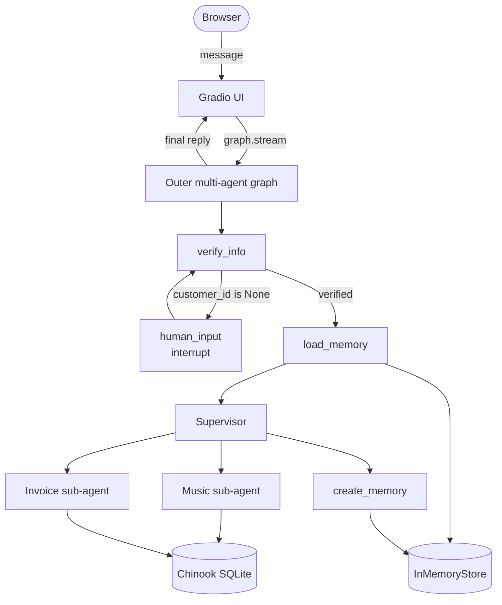
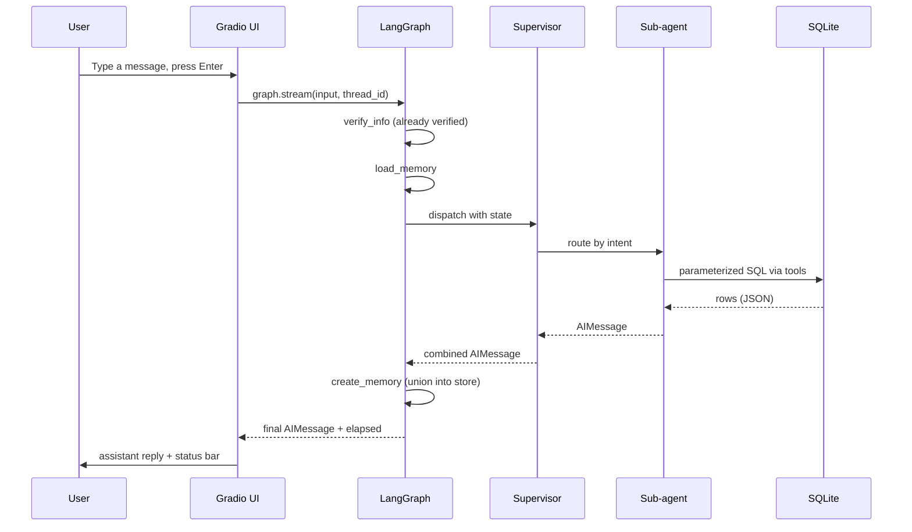

# Music Store Multi-Agent Support

A production-shaped LangGraph multi-agent assistant for a digital music store: identity-verified, tool-grounded, supervisor-routed, and runnable in a single Python process.

[](LICENSE)
[](https://www.python.org/downloads/release/python-3120/)
[](https://github.com/langchain-ai/langgraph)
[](https://gradio.app)
[](https://huggingface.co/spaces/animeshkcm/Multi-Agent-Customer-Support)
[](https://github.com/ANI-IN/Multi-Agent-Customer-Support/actions/workflows/ci.yml)

## What This Is

This project is a chat assistant for a fictional digital music store. A customer can ask about albums, tracks, artists, and genres, and (after verifying their identity) about their own purchases. Behind the scenes, a hierarchical agent graph splits responsibilities so the assistant cannot hallucinate accounts, leak data across customers, or invent invoice totals. The whole thing runs locally as a Gradio web app, in a Docker container, or on Hugging Face Spaces.

**Live demo:** [huggingface.co/spaces/animeshkcm/Multi-Agent-Customer-Support](https://huggingface.co/spaces/animeshkcm/Multi-Agent-Customer-Support)

## Table of Contents

- [What This Is](#what-this-is)
- [The Problem](#the-problem)
- [The Solution](#the-solution)
- [Who It Is For and Use Cases](#who-it-is-for-and-use-cases)
- [Key Features](#key-features)
- [Demo](#demo)
- [Architecture](#architecture)
- [Tech Stack](#tech-stack)
- [Prerequisites](#prerequisites)
- [Installation](#installation)
- [Configuration](#configuration)
- [Running the App](#running-the-app)
- [Using the App Step by Step](#using-the-app-step-by-step)
- [Code Walkthrough](#code-walkthrough)
- [Sample Data](#sample-data)
- [Customization](#customization)
- [Troubleshooting](#troubleshooting)
- [Project Structure](#project-structure)
- [Security Notes](#security-notes)
- [Contributing](#contributing)
- [License](#license)
- [Acknowledgments](#acknowledgments)

## The Problem

Customer support for a catalog and billing business sits between two opposing pressures:

- **Customers ask in free-form natural language.** "What's my most expensive track?", "Any rock albums by AC/DC?", "Who helped me last month?".
- **Operational answers must be exact.** Invoice totals, track IDs, customer accounts, and support reps must be precise, auditable, and never mixed across customers.

A single LLM with a single system prompt cannot satisfy both. Without strong scaffolding it will hallucinate albums it has not seen, round invoice totals, route off-topic questions to SQL tools, or worse, return one customer's invoices to another. The cost of getting any one of these wrong in production ranges from "embarrassing chat log" to "regulatory incident."

## The Solution

This project solves the gap by splitting responsibilities into a hierarchical agent graph. Each capability lives in its own node with its own contract, and the graph wiring (not the LLM) is what enforces correctness.

| Pain | Capability in this project |
|---|---|
| Hallucinated albums or prices | Tool-only grounding rules; every sub-agent prompt forbids answering from model memory |
| Cross-customer data leaks | `customer_id` is set by `verify_info` only and passed via `SystemMessage`; the invoice agent reads it from there, not from user text |
| Random sampling that changes every call | `get_songs_by_genre` uses a CTE with `ROW_NUMBER()` so the same question returns the same answer |
| Off-topic questions touching SQL | Supervisor refuses out-of-scope queries before routing to any sub-agent |
| Memory write that erases prior data | `create_memory` is a set union and skips writes when the LLM returns empty against a non-empty profile |
| Identity laundering through chat history | The `customer_id` field is write-once per session by `verify_info`; sub-agents and tools cannot mutate it |

The result is "LLM plus tools" turned into a **system** with predictable invariants you can test for.

## Who It Is For and Use Cases

This is both a working chat assistant and a reference implementation of multi-agent patterns for AI engineers.

### 1. Catalog discovery for an anonymous shopper

- **Persona.** A potential customer browsing the store before signing up.
- **Situation.** "Do you carry any AC/DC albums?" "What jazz tracks do you have?"
- **Outcome.** The supervisor routes to the music sub-agent, which calls the catalog tools and answers from real rows. No account access is required, no PII is exposed.

### 2. Account lookup for a verified customer

- **Persona.** An existing customer with a question about their own purchases.
- **Situation.** "What did I pay on my last invoice?" "Who was the support rep?"
- **Outcome.** The graph pauses at `human_input` if the identity is unknown, performs a database lookup once verified, and only then lets the invoice sub-agent see the customer's data.

### 3. Personalized recall for a returning customer

- **Persona.** A repeat customer who has expressed musical preferences in earlier turns.
- **Situation.** "What genres do you think I would like?"
- **Outcome.** `load_memory` reads the per-customer profile from the long-term store and injects it into the music agent's prompt so it can personalize without re-asking.

### 4. Reference architecture for AI engineers

- **Persona.** An engineer learning how to build production-shaped agent systems.
- **Situation.** They want to see structured-output verification, parameterized SQL under an LLM, deterministic sampling, set-union memory writes, and `interrupt`-based human-in-the-loop in one repository.
- **Outcome.** Every pattern is in one ~1,650-line Python codebase with 28 deterministic tests.

## Key Features

User-facing:

- Two specialized assistants behind one chat window: music catalog and invoice information.
- Identity verification by customer ID, email, or phone (international formats normalized).
- Per-customer music preference memory that survives across turns in a session.
- Streaming status bar that shows when the agent is thinking, which data sources were used, and how long each turn took.
- One-click "New Conversation" that issues a fresh thread ID and clears the chat.

Technical:

- Hierarchical LangGraph state machine with conditional edges, interrupts, and a supervisor router.
- Typed shared state via `TypedDict` plus an `add_messages` reducer.
- Structured LLM outputs (Pydantic `UserInput`, `UserProfile`) instead of regex parsing.
- 100% parameterized SQL through SQLAlchemy `text()` bindings; numeric tool arguments validated by `_safe_int`.
- Deterministic genre sampling via a CTE with `ROW_NUMBER() OVER (PARTITION BY ArtistId ORDER BY TrackId)`.
- Per-thread checkpointing (`MemorySaver`) and per-customer long-term store (`InMemoryStore`).
- 28 pytest tests covering the SQL helpers and every tool function, deterministic and offline (no LLM calls).

Intentionally not included:

- Persistent storage. Both the checkpointer and the long-term store are in-memory by design. The README and architecture doc explain where to swap them in.
- A multi-tenant authentication layer. The project demonstrates identity verification against a sample dataset; production tenants would need a real auth provider in front.
- Streaming individual tokens. The UI streams at LangGraph node-event granularity, which is enough for a snappy feel without a custom token pump.

## Demo

The Gradio UI in a typical verified session looks like this:

```
+---------------------------------------------------------------+
|  Music Store Assistant                                        |
|  Welcome! I can help you explore our music catalog,           |
|  look up invoices, and find your purchase history.            |
+---------------------------------------------------------------+
|                                                               |
|  You:        My customer ID is 5                              |
|                                                               |
|  Assistant:  Hi Frantisek! I have verified your account.      |
|              How can I help today?                            |
|                                                               |
|  You:        What was my most recent purchase?                |
|                                                               |
|  Assistant:  Your most recent invoice is #382 dated           |
|              2025-08-07 for $8.91. It included:               |
|              - Per Te (Pavarotti), $0.99 x 1                  |
|              ...                                              |
|                                                               |
+---------------------------------------------------------------+
| [v] Responded in 1.4s | Data sources: invoice_lookup          |
+---------------------------------------------------------------+
| Type your message here...                            [ Send ] |
+---------------------------------------------------------------+
| [ New Conversation ]                                          |
+---------------------------------------------------------------+
```

The status bar at the bottom shows the current state (`Ready`, `Processing`, `Waiting for your input`, `Responded in N.Ns`) and the data sources that were touched during the last turn (`music_catalog`, `invoice_lookup`, or both).

The live deployment on Hugging Face Spaces is linked at the top of this README.

## Architecture

The system is a hierarchical state machine. A user message enters `verify_info`, optionally pauses for identity verification, loads any persisted preferences, dispatches to a sub-agent via the supervisor, records updated memory, and returns the response.



A typical verified turn looks like this end to end:



A longer walkthrough (state machine diagrams, "what lives where" table, trust boundaries, invariants, performance notes, and roadmap) lives in [docs/architecture.md](docs/architecture.md).

## Tech Stack

| Layer | Tool | Why it is here |
|---|---|---|
| Language | Python 3.12 | Modern type hints; latest version stable on Hugging Face Spaces (3.13 removes `audioop`, which transitive deps still import) |
| UI | Gradio 5.29+ | Built-in chat component, streaming, easy deploy to Hugging Face Spaces |
| Agent orchestration | LangGraph 1.0+ | State machines, conditional edges, checkpointing, `ToolNode`, `interrupt` |
| Supervisor router | langgraph-supervisor 0.0.20+ | Hierarchical routing pattern out of the box |
| Prebuilt ReAct | langgraph-prebuilt 1.0+ | `create_react_agent` for the invoice sub-agent |
| LLM integration | langchain-openai 1.0+ | `ChatOpenAI` works against any OpenAI-protocol endpoint |
| Core framework | langchain + langchain-core + langchain-community | Messages, tool decorator, `SQLDatabase` utility |
| Data validation | Pydantic v2 | `UserInput`, `UserProfile` schemas for structured LLM output |
| Database engine | SQLAlchemy 2.0+ | In-memory SQLite via `StaticPool`, safe parameter binding |
| Sample dataset | Chinook | Realistic schema: customers, employees, invoices, tracks, albums, genres |
| Checkpointer | `MemorySaver` | Per-thread short-term graph state |
| Long-term store | `InMemoryStore` | Per-customer music preferences |
| Env config | python-dotenv | Loads `.env` once at import |
| HTTP client | requests 2.31+ | One-shot fetch of the Chinook SQL script on first run |
| Container | Docker (python:3.12-slim) | Reproducible deploy |
| Hosting | Hugging Face Spaces | YAML frontmatter at the top of this README configures the Space |
| Test runner | pytest | 28 deterministic tests over SQL helpers and tools |
| Lint | ruff | Configured in `pyproject.toml` |
| Pre-commit | pre-commit + ruff + gitleaks | Whitespace, line endings, lint, format, secret scan |
| CI | GitHub Actions | Lint, compile, pytest, gitleaks on every push and PR |

## Prerequisites

- **Python 3.12.** Tested on 3.12.x. Python 3.13 is currently blocked because the Gradio dependency chain still imports `audioop`, which 3.13 removed.
- **An OpenAI-compatible chat completions endpoint and API key.** OpenAI, Groq, Together AI, Azure OpenAI, LM Studio, Ollama, and vLLM all work.
- **Git.**
- **Docker** (optional, only for the container path).
- Approximately **300 MB free disk** for dependencies and the Chinook SQL cache.

The project does not need a GPU; latency is dominated by the LLM provider's response time.

## Installation

### Option A: virtualenv

```bash
git clone https://github.com/ANI-IN/Multi-Agent-Customer-Support.git
cd Multi-Agent-Customer-Support

python3.12 -m venv venv
source venv/bin/activate          # Windows: venv\Scripts\activate

pip install --upgrade pip
pip install -r requirements.txt

cp .env.example .env
# Edit .env and set OPENAI_API_KEY.

python app.py
# Open http://localhost:7860
```

### Option B: Docker

```bash
docker build -t music-support .

docker run --rm -p 7860:7860 \
  -e OPENAI_API_KEY=sk-... \
  -e MODEL_NAME=gpt-4o-mini \
  music-support
```

### Option C: Docker Compose

```bash
cp .env.example .env
# Edit .env.

docker compose up --build
```

The compose file (`docker-compose.yml`) reads `.env`, restarts on failure, and exposes a basic healthcheck on port `7860`.

### Hugging Face Spaces

The YAML frontmatter at the top of this README is the Space configuration. Push the repository to a Gradio Space, set `OPENAI_API_KEY` under **Settings -> Repository Secrets**, and HF builds and runs `app.py` automatically. Python is pinned to 3.12.

## Configuration

All configuration is environment-driven. `src/config.py` calls `load_dotenv()` once at import.

### Environment variables

| Variable | Required | Default | Where it is read | Notes |
|---|---|---|---|---|
| `OPENAI_API_KEY` | yes | empty | `src/config.py:15` | Sensitive. Never commit. |
| `OPENAI_API_BASE` | no | empty | `src/config.py:16` | Override for any OpenAI-protocol provider |
| `MODEL_NAME` | no | `gpt-4o-mini` | `src/config.py:17` | Chat model identifier |
| `TEMPERATURE` | no | `0` | `src/config.py:18` | `0` keeps routing deterministic; raise carefully |
| `PORT` | no | `7860` | `src/config.py:19` | Gradio HTTP port |

### Knobs in code

Tunables that are intentionally not environment variables, listed with where to change them.

| Knob | File | Notes |
|---|---|---|
| App title and welcome blurb | `src/config.py:20-25` | Shown in the Gradio header |
| Music-agent sample limit (20 tracks) | `src/tools/music_catalog.py:80` | `LIMIT 20` on `get_tracks_by_artist` |
| Genre-sample limit (10 artists) | `src/tools/music_catalog.py:141` | `LIMIT 10` in the deterministic CTE |
| Song-title-search limit (10 hits) | `src/tools/music_catalog.py:187` | `LIMIT 10` on `check_for_songs` |
| Memory window for preference extraction | `src/agents/nodes.py:203` | `state["messages"][-10:]` |
| Status-bar colors and icons | `src/ui/app.py:47-76` | `_status_html` |
| UI theme and font | `src/ui/app.py:179-184` | `gr.themes.Soft(..., font=gr.themes.GoogleFont("Inter"))` |

### Provider configuration

The project speaks the OpenAI protocol. To use a non-OpenAI provider, set both `OPENAI_API_BASE` and `OPENAI_API_KEY`.

<details>
<summary>OpenAI (default)</summary>

```env
OPENAI_API_KEY=sk-...
MODEL_NAME=gpt-4o-mini
```
</details>

<details>
<summary>Groq</summary>

```env
OPENAI_API_BASE=https://api.groq.com/openai/v1
OPENAI_API_KEY=gsk_...
MODEL_NAME=llama-3.3-70b-versatile
```
</details>

<details>
<summary>Together AI</summary>

```env
OPENAI_API_BASE=https://api.together.xyz/v1
OPENAI_API_KEY=...
MODEL_NAME=meta-llama/Llama-3.3-70B-Instruct-Turbo
```
</details>

<details>
<summary>Azure OpenAI</summary>

```env
OPENAI_API_BASE=https://your-resource.openai.azure.com/
OPENAI_API_KEY=...
MODEL_NAME=your-deployment-name
```
</details>

<details>
<summary>Local (LM Studio / Ollama / vLLM)</summary>

```env
OPENAI_API_BASE=http://localhost:1234/v1
OPENAI_API_KEY=not-needed
MODEL_NAME=your-local-model
```
</details>

Routing depends on the model following structured instructions. Models below roughly seven billion parameters often degrade on mixed-intent queries.

## Running the App

After installation:

```bash
python app.py
# Then open http://localhost:7860
```

The console prints structured log lines for each graph event. Look for:

- `LLM initialized: gpt-4o-mini, temperature=0` at startup.
- `Database verification OK.` on first request.
- `Graph event: node=verify_info` and similar for each node invocation.
- `TOOL_CALL: <tool_name> | <args>` and `TOOL_RESULT: <tool_name> | result_length=N` per tool execution.

You can also import and drive the graph headlessly:

```python
from langchain_core.messages import HumanMessage
from src.agents.graph import build_graph
from src.config import settings

graph, _, _ = build_graph(
    model_name=settings.model_name,
    temperature=settings.temperature,
    openai_api_key=settings.openai_api_key or None,
    openai_api_base=settings.openai_api_base or None,
)

config = {"configurable": {"thread_id": "demo"}}
for event in graph.stream(
    {"messages": [HumanMessage(content="My customer ID is 5")]},
    config=config,
    stream_mode="updates",
):
    print(event)
```

## Using the App Step by Step

1. Start the server. The status bar shows `Ready - type a message to begin`.
2. Identify yourself. Type one of:
   - A customer ID: `My customer ID is 5`
   - An email: `frantisekw@jetbrains.com`
   - A phone number: `+55 (12) 3923-5555`
3. The graph runs `verify_info`. If the identifier matches a Chinook customer, you are verified and the status switches to `Responded in N.Ns`. If not, the agent re-prompts.
4. Ask a music catalog question. Examples:
   - `What AC/DC albums do you have?`
   - `Show me Jazz tracks.`
   - `Find the song "Balls to the Wall".`
5. Ask an invoice question. Examples:
   - `What was my most recent invoice?`
   - `Which track did I pay the most for?`
   - `Who helped me on invoice 382?`
6. Express a preference. The next line is captured and persisted to the in-memory store:
   - `I love rock music.`
7. Ask the assistant to recall later in the session:
   - `What genres do you think I would like?`
8. Click **New Conversation** to clear chat history and rotate the thread ID. (Persisted preferences for the same `customer_id` carry across `New Conversation` clicks, since they are scoped per-customer, not per-thread. Restarting the process clears them.)

## Code Walkthrough

Read the files in this order to learn the codebase quickly.

| Step | File | Lines | What you learn |
|---|---|---|---|
| 1 | `src/state.py` | 1-12 | The shared state contract used by every node |
| 2 | `src/agents/graph.py` | 26-129 | How the music subgraph, the invoice ReAct agent, and the supervisor are composed into one outer state machine |
| 3 | `src/agents/nodes.py` | 79-158 | The two core nodes: `music_assistant` and `verify_info` |
| 4 | `src/agents/nodes.py` | 24-66 | How identifiers (numeric, email, normalized phone) are resolved to a `customer_id` |
| 5 | `src/agents/nodes.py` | 166-234 | Memory load and memory union-write semantics |
| 6 | `src/agents/prompts.py` | 1-156 | The behavioral contracts for every LLM call: grounding rules, refusal text, memory rules |
| 7 | `src/tools/music_catalog.py` | 18-238 | Five tools, including the deterministic genre sample with `ROW_NUMBER()` |
| 8 | `src/tools/invoice.py` | 18-146 | Four customer-scoped invoice tools |
| 9 | `src/db/database.py` | 13-107 | Engine bootstrap, `run_query_safe`, `normalize_phone`, `verify_database` |
| 10 | `src/ui/app.py` | 94-170 | Gradio stream handler: how `snapshot.next` is used to detect a paused interrupt and resume cleanly |

Pipeline stages in execution order:

- **`verify_info`** (`src/agents/nodes.py:114-158`). Calls `llm.with_structured_output(UserInput)` to extract one identifier, then runs a parameterized lookup against `Customer`. On success, writes `customer_id` and announces it in a `SystemMessage`. On failure, asks again using `VERIFICATION_PROMPT`.
- **`human_input`** (`src/agents/nodes.py:161-163`). Calls LangGraph `interrupt("Please provide input.")`. The UI surfaces this as a waiting state.
- **`load_memory`** (`src/agents/nodes.py:166-181`). Reads `("memory_profile", customer_id)` from the long-term store and sets `loaded_memory`.
- **`supervisor`** (built in `src/agents/graph.py:86-98`). Routes by intent following `SUPERVISOR_PROMPT`: music or invoice, mixed (invoice first), or off-topic refusal.
- **`music_catalog_subagent`** (built in `src/agents/graph.py:53-68`). Hand-built ReAct loop: LLM-with-tools node plus a `ToolNode(music_tools)` and a `should_continue` conditional edge.
- **`invoice_information_subagent`** (built in `src/agents/graph.py:72-80`). `langgraph.prebuilt.create_react_agent` with `invoice_tools`. The prompt insists the verified customer ID comes from the `SystemMessage`, not from user text.
- **`create_memory`** (`src/agents/nodes.py:184-234`). Summarizes the last 10 messages, extracts preferences via `llm.with_structured_output(UserProfile)`, and writes the set union into the store. Empty LLM output against a non-empty existing profile is a no-op (never erases).

## Sample Data

The application boots against the [Chinook sample database](https://github.com/lerocha/chinook-database), loaded into an in-memory SQLite instance via `StaticPool`. On first run the SQL script is read from `Chinook_Sqlite.sql` at the repo root; if missing, it is downloaded and cached.

| Table | Rows | Purpose | Tools that read it |
|---|---:|---|---|
| Customer | 59 | Identity, address, support rep FK | `verify_info` |
| Employee | 8 | Support rep details | `get_employee_by_invoice_and_customer` |
| Invoice | 412 | Billing header | `get_invoices_by_customer_sorted_by_date`, `get_employee_by_invoice_and_customer` |
| InvoiceLine | 2,240 | One purchased track per row | `get_invoice_line_items*` |
| Track | 3,503 | Catalog row | All music and invoice tools |
| Album | 347 | Album row | `get_albums_by_artist`, `get_tracks_by_artist` |
| Artist | 275 | Artist row | All music tools |
| Genre | 25 | Genre row | `get_songs_by_genre`, `get_track_details` |
| MediaType | 5 | Format (MPEG, AAC, etc.) | `get_tracks_by_artist`, `get_track_details` |
| Playlist | 18 | Curated lists | Not currently exposed |
| PlaylistTrack | 8,715 | Join table | Not currently exposed |

### Try asking

Once verified (start with `My customer ID is 5`), the following questions all return real, grounded answers.

| Try asking | What it exercises |
|---|---|
| `What AC/DC albums do you have?` | `get_albums_by_artist` |
| `Show me tracks by Iron Maiden.` | `get_tracks_by_artist` (with total + sample) |
| `What jazz songs are in the catalog?` | `get_songs_by_genre` (deterministic CTE) |
| `Find "Balls to the Wall".` | `check_for_songs` |
| `What was my last invoice?` | `get_invoices_by_customer_sorted_by_date` |
| `Which track did I pay the most for?` | `get_invoice_line_items_sorted_by_price` |
| `Who was the support rep on my last invoice?` | `get_invoices_by_customer_sorted_by_date` then `get_employee_by_invoice_and_customer` |
| `What tracks were on invoice 382?` | `get_invoice_line_items` |
| `I love jazz.` | `create_memory` union write |
| `What's the weather today?` | Supervisor off-topic refusal (no sub-agent called) |

## Customization

Common changes a maintainer is likely to make, paired with the file and line range to edit.

| Change | File:lines |
|---|---|
| Switch the default model | `src/config.py:17` |
| Raise or lower the LLM temperature | `src/config.py:18` |
| Increase the sample size for `get_tracks_by_artist` | `src/tools/music_catalog.py:80` |
| Increase the sample size for `get_songs_by_genre` | `src/tools/music_catalog.py:141` |
| Add a new music tool | `src/tools/music_catalog.py` (add `@tool` function, then append to `music_tools` list at the end of the file) |
| Add a new invoice tool | `src/tools/invoice.py` (same pattern; remember `_safe_int` for numeric args) |
| Replace `MemorySaver` with `SqliteSaver` | `src/agents/graph.py:47` |
| Replace `InMemoryStore` with a persistent store | `src/agents/graph.py:46` |
| Change the supervisor routing rules | `src/agents/prompts.py:82-105` |
| Adjust how many recent messages feed memory extraction | `src/agents/nodes.py:203` |
| Restyle the chat UI | `src/ui/styles.py` |
| Add a new top-of-page link or banner | `src/ui/app.py:189-196` |
| Pin a different Python version on Hugging Face Spaces | the YAML frontmatter at the top of this README (`python_version: "3.12"`) |

## Troubleshooting

| Symptom | Cause | Fix |
|---|---|---|
| `ModuleNotFoundError: gradio` (or langchain, langgraph) | Dependencies are not installed in the active environment | `pip install -r requirements.txt` |
| `ModuleNotFoundError: audioop` | Running on Python 3.13, which removed `audioop` | Use Python 3.12; recreate the venv with `python3.12 -m venv venv` |
| App boots but says `OPENAI_API_KEY not set` | The `.env` file is missing or the key is empty | `cp .env.example .env` and set `OPENAI_API_KEY` |
| Verification keeps failing for a real ID | The identifier does not match any Chinook customer | Try customer ID `5` (Frantisek Wichterlova), email `luisg@embraer.com.br`, or phone `+55 (12) 3923-5555` |
| First start hangs for a few seconds | `Chinook_Sqlite.sql` is being downloaded and cached | One-time cost; subsequent runs read the cache |
| Docker container is unreachable on `http://localhost:7860` | The container is bound to `127.0.0.1` inside, which is not the host's loopback | The Dockerfile already binds to `0.0.0.0`; confirm `-p 7860:7860` is on your `docker run` command |
| Gradio raises `TypeError: argument of type 'bool' is not iterable` at startup | Stale Gradio / gradio-client schema bug | Upgrade to `gradio>=5.29.0` (already pinned in `requirements.txt`); reinstall with `pip install -U -r requirements.txt` |
| Routing sometimes sends invoice questions to the music agent | A small or local model is misreading the supervisor prompt | Set `TEMPERATURE=0`, switch to a stronger model, or set `OPENAI_API_BASE` to a hosted provider |
| Memory does not persist after restart | Both the checkpointer and the long-term store are in-memory by design | Swap `MemorySaver` and `InMemoryStore` in `src/agents/graph.py:46-47` for persistent backends |
| `pytest` is missing | Developer tools not installed | `pip install pytest` (the test runner is not a runtime dependency) |

## Project Structure

```
Multi-Agent-Customer-Support/
|-- app.py                       # Entry point for local dev and Hugging Face Spaces
|-- Dockerfile                   # Python 3.12-slim image, exposes :7860
|-- docker-compose.yml           # Local compose service with healthcheck (added)
|-- requirements.txt             # Runtime dependencies (pinned floors)
|-- pyproject.toml               # ruff, black, and pytest configuration (added)
|-- .env.example                 # Placeholder environment variables
|-- .editorconfig                # Whitespace and line-ending defaults (added)
|-- .pre-commit-config.yaml      # Pre-commit hooks: ruff, gitleaks, basics (added)
|-- .gitignore                   # Excludes .env, caches, Chinook SQL, .claude/
|-- .dockerignore                # Trims context for image builds
|-- LICENSE                      # MIT (added)
|-- CHANGELOG.md                 # Keep-a-Changelog format (added)
|-- CODE_OF_CONDUCT.md           # Contributor Covenant v2.1 (added)
|-- CONTRIBUTING.md              # Setup, style, PR conventions (added)
|-- SECURITY.md                  # Private disclosure path and known risk areas (added)
|-- README.md                    # This document
|
|-- .github/
|   |-- workflows/
|   |   `-- ci.yml               # Lint + compile + pytest + gitleaks (added)
|   |-- ISSUE_TEMPLATE/
|   |   |-- bug_report.md        # (added)
|   |   `-- feature_request.md   # (added)
|   `-- PULL_REQUEST_TEMPLATE.md # (added)
|
|-- docs/
|   |-- architecture.md          # Flowchart, sequence, what-lives-where, invariants (added)
|   `-- getting-started.md       # venv / Docker / Compose paths (added)
|
|-- src/
|   |-- __init__.py
|   |-- config.py                # Settings class; reads env, sets logging
|   |-- state.py                 # LangGraph State TypedDict
|   |-- models.py                # Pydantic schemas: UserInput, UserProfile
|   |-- db/
|   |   |-- __init__.py          # Re-exports the public DB API
|   |   `-- database.py          # Engine, run_query_safe, normalize_phone, verify_database
|   |-- tools/
|   |   |-- __init__.py          # Re-exports music_tools, invoice_tools
|   |   |-- music_catalog.py     # 5 @tool functions (fuzzy SQL, deterministic sampling)
|   |   `-- invoice.py           # 4 @tool functions (customer-scoped queries)
|   |-- agents/
|   |   |-- __init__.py
|   |   |-- prompts.py           # All system prompts (supervisor, sub-agents, verification, memory)
|   |   |-- nodes.py             # verify_info, human_input, load_memory, create_memory, music_assistant, helpers
|   |   `-- graph.py             # build_graph(): subgraphs, supervisor, outer graph
|   `-- ui/
|       |-- __init__.py
|       |-- app.py               # Gradio Blocks, stream handler, status bar, reset button
|       `-- styles.py            # Custom CSS
|
`-- tests/
    |-- __init__.py
    |-- conftest.py              # Session-scoped DB fixture
    |-- test_database.py         # 11 tests: run_query_safe, normalize_phone, verify_database
    `-- test_tools.py            # 17 tests: every music and invoice tool, found / not-found / determinism
```

Files marked **(added)** in the tree above are new in this revision. The application code under `src/`, the test suite under `tests/`, and the original `app.py`, `Dockerfile`, `.dockerignore`, `.gitignore`, `.env.example`, and `requirements.txt` were not modified.

## Security Notes

This project takes a few defensive postures worth knowing about:

- All SQL is parameterized via SQLAlchemy `text()` with bound parameters. There is no f-string or concatenation against user input anywhere.
- The `customer_id` field is written exactly once by `verify_info` after a database lookup. Sub-agents and tools read it but never set it.
- The invoice sub-agent's prompt explicitly tells the model to use the verified customer ID from the `SystemMessage`, not from user text.
- `create_memory` is a set union; an empty LLM result against a non-empty profile is a no-op, so a hallucinated empty response cannot erase preferences.
- `.gitignore` excludes `.env`, `*.db`, and cache directories so secrets and local data do not get committed.
- A `gitleaks` scan runs both as a pre-commit hook (see `.pre-commit-config.yaml`) and in CI (see `.github/workflows/ci.yml`).

Full disclosure process and a description of each sensitive surface live in [SECURITY.md](SECURITY.md). Please do not file public issues for vulnerabilities; use the private security advisory link in `SECURITY.md` instead.

## Contributing

Pull requests are welcome. Please read [CONTRIBUTING.md](CONTRIBUTING.md) for the local setup, code style, test expectations, and PR conventions, and [CODE_OF_CONDUCT.md](CODE_OF_CONDUCT.md) for community norms. In short:

- Use Python 3.12 and `pip install -r requirements.txt`.
- Install the developer toolchain with `pip install ruff pytest pre-commit` and run `pre-commit install`.
- Keep PRs focused; one logical change per commit.
- Add or update tests for behavior changes.
- Use Conventional Commits in commit subjects.

## License

This project is released under the MIT License. See [LICENSE](LICENSE) for the full text.

## Acknowledgments

- [LangGraph](https://github.com/langchain-ai/langgraph) for the graph orchestration primitives, checkpointing, and `interrupt` semantics that make human-in-the-loop turns trivial.
- [LangChain](https://github.com/langchain-ai/langchain) for `ChatOpenAI`, the `@tool` decorator, and the `SQLDatabase` utility.
- [Gradio](https://gradio.app) for the chat UI components, streaming primitives, and the painless deploy to Hugging Face Spaces.
- [Chinook Database](https://github.com/lerocha/chinook-database) by Luis Rocha for a small, realistic schema that makes every example query meaningful.
- [Pydantic](https://pydantic.dev) for the structured-output schemas that keep LLM outputs honest.
- The Contributor Covenant for the Code of Conduct template.
